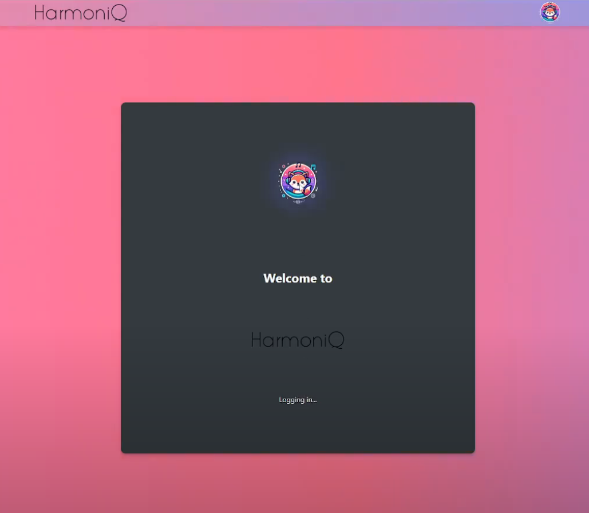

# Harmoniq

## Overview
**Harmoniq** is a mood-based music playlist generator that integrates Spotify and sentiment analysis to create personalized playlists based on how you're feeling.

---

## Features
- **Spotify Integration**: Log in with Spotify to access your account details.
- **Mood-Based Playlist Creation**: Enter how you're feeling, and the app generates a playlist tailored to your mood.
- **Sentiment Analysis**: Uses Hugging Face's **RoBERTa** model to analyze user input and determine mood.
- **Genre and Artist Preferences**: Optionally customize your playlist by selecting genres or using your favorite artists.

---

## Tech Stack
- **Frontend**: React
- **Backend**: Node.js, Express.js
- **APIs**:
  - **Spotify API**: For user data and playlist creation.
  - **Flask API**: For mood analysis using Hugging Face **RoBERTa**.

---

## Project Workflow

### Authentication
- Users log in using Spotify’s OAuth flow.

### Sentiment Analysis
- Text input is analyzed using a Flask API to determine valence and energy levels.

### Playlist Generation
- The app interacts with Spotify’s API to create and populate playlists based on mood and preferences.

---
## Demo Video

---
